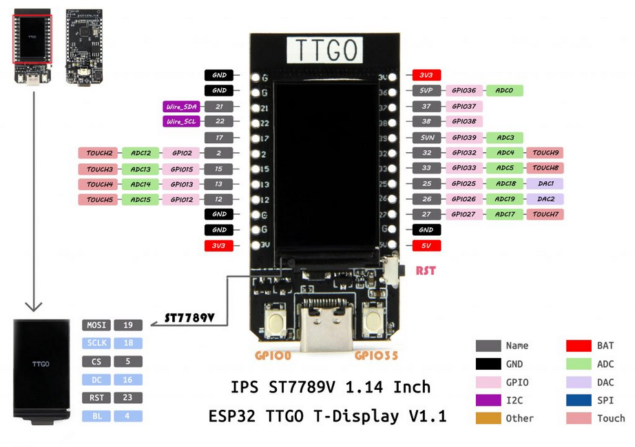
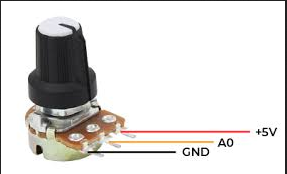
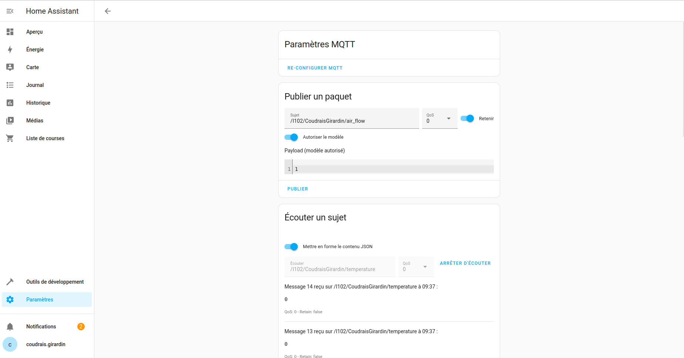
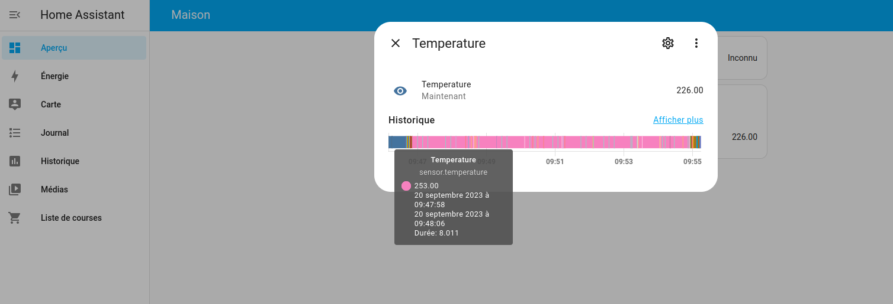
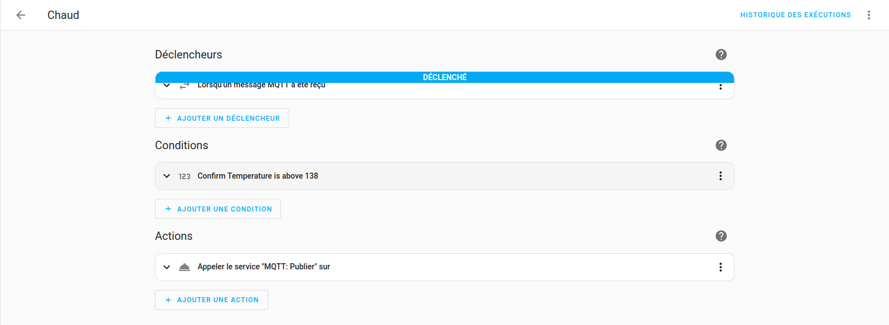
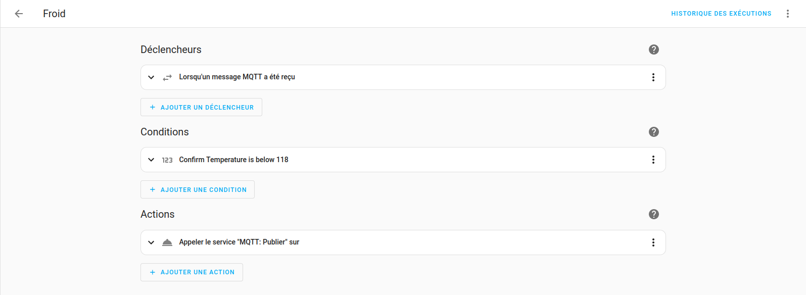

[Accueil](https://gitlab.com/cpelyon/rob/5irc-2023-2024/eic/sujet_1_tps_eic/S1_G3_Coudrais_Girardin/-/tree/main) </br>
[Partie 2](../Part2) </br>
[Partie 3](../Part3)</br>
[Partie 4](../Part4)

# ESP32 lecture potentiomètre 
- On branche nos devices selon les schéma suivants : 
  
  
- On a donc le pin de signal analogique au milieu du potentiometre et sur le port 36 de notre esp32
- La ligne suivante de notre code arduino nous permet de récupérer le signal analogique avec une précision de 2¹² : `analogRead(A0)` 

# Montage du broker MQTT sur le routeur de la salle avec docker
- On lance finalement le docker compose que l'on a un peu modifié car on utilise les machines de CPE 
- - On a changé le port par défaut car il était deja utilisé par une autre instace MQTT 
- - On change la destination des fichiers de log, config... pour les mettre dans les fichier tmp de la machine.
- Il faut également rajouter le fichier de config mqtt suivant afin de désactiver l'authentification. On les rajoutera au niveaux des dossier de config renseigné dans le docker compose 
```
allow_anonymous true
listener 1884
persistence true
persistence_location mosquitto/data/
log_dest file /mosquitto/log/mosquitto.log
```
- On a ensuite bien le conteneur qui tourne, on regarde notre adresse ip de notre machine sur le réseau de la salle de tp puis on envoie des message de test sur le topic avec le bon port et la bonne adresse avec la commande suivante : `mosquitto_pub -h 192.168.1.113 -m 'test' -t /I102/CoudraisGirardin/air_flow -p 1884`

# Ajout de MQTT dans notre arduino publisher
- Il faut tout d'abord se connecter au wifi pour pouvoir publier sur le conteneur MQTT précedemment créé
- Puis on se connecte au broker mqtt
- Puis si on est connecté on envoie la température /16 pour qu'elle soit entre 0 et 255.
- Puis on écoute également sur le topic ou l'on envoie pour afficher un mesage de confirmation de l'envoi.

# Lien entre 2 topic en python. 
- Cette entité jouera le role de traitement des données et décidera de si on envoie l'information d'ouvrir le servo ou non. 
- On écoute donc sur notre topic `/I102/CoudraisGirardin/temperature` et des qu'on recoit une info on la traite, on envoie 0 si la temp est basse et 1 si la temp est haute. Si elle est dans une certaine range, on envoie rien. On envoie seulement des infos lors des changements d'état. 
- On peut tester que notre python fonctionne bien avec la commande suivante : `mosquitto_sub -h 192.168.1.113 -t /I102/CoudraisGirardin/air_flow -p 1884`

# Réception avec l'autre esp32 
- On utilise donc un autre code arduino pour gérer l'autre esp32 afin de recevoir un booléen pour nous indiquer de l'ouverture ou fermeture de notre volet
- Dans le premier code du premier esp32, on gère aussi la réception de message pour etre sur que c'est bien envoyé. Donc on a juste a reprendre le même principe
- De la même manière on gère aussi la connexion au wifi ainsi que la reconnexion au borker mqtt

# Ouverture / Fermeture du servo.
- Lorsqu'on recoit un message sur le topic `/I102/CoudraisGirardin/air_flow` auquel on s'est abonné, on vérifier la valueur recu puis on ouvre ou ferme le volet en changeant la position du servomoteeur comme décrit dans le cours.

# Vidéo à ce stade 
[Vidéo (eictp1demo.mp4)](../images_videos/eictp1demo.mp4)


# Remplacement du code python avec Home assistant.
- Pour cette partie, on reprend donc le docker-compose donné puis on rajoute le conteneur home assistant en modifiant les bout de code nécessaire. 
- On a ensuite accès a home assistant en local sur l'url suivante : `http://localhost:8123`
- En se rendant dans les service home assistant on peut configurer un service mqtt, en le configurant correctement, on peut publier et souscrire a des topics de notre broker mqtt : 

- Ensuite on rajoute une entité de type capteur en allant changer le contenu du fichier `config/configuration.yaml` directement dans le conteneur docker home assistant. On rajoute donc le contenu suivant dans la config pour avoir une capteur qui récupère la température en écoutant sur le bon topic : 
```
mqtt:
  - sensor:
      name: "Temperature"
      state_topic: "/I102/CoudraisGirardin/temperature"
      suggested_display_precision: 1
```
- - On resynchronise ensuite notre home assistant puis on peut voir la température : 

- On essaye ensuite de faire en sorte que notre home assistant remplace notre code python. Pour cela on va créer des automatisation qui vnt ecouter sur le topic puis en fonction du la valeur du capteur va publier 1 ou 0 sur le topic `air_flow` : 
 


# Sources 
- https://randomnerdtutorials.com/esp32-mqtt-publish-subscribe-arduino-ide/
- https://stackoverflow.com/questions/70133192/how-to-use-both-subscribe-and-publish-at-the-same-time-in-mqtt-python
- https://isurunuwanthilaka.medium.com/get-into-mqtt-in-2-minutes-python-docker-5d4e8b55cf1c