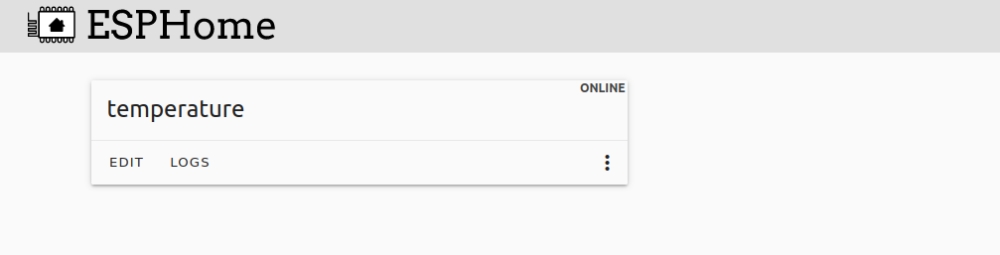

[Accueil](https://gitlab.com/cpelyon/rob/5irc-2023-2024/eic/sujet_1_tps_eic/S1_G3_Coudrais_Girardin/-/tree/main) </br>
[Partie 1](../Part1/) </br>
[Partie 3](../Part3)</br>
[Partie 4](../Part4)

# ESPHome et HomeAssistant
- On lance le docker compose que l'on a afin de lancer un conteneur pour notre esphome et notre homeassistant
- Comme nous l'indique l'execution du docker compose, on peut accéder au portail esphome a l'adresse : `http://0.0.0.0:6052/`

# Premiere carte ESP : 
- On fait une premier fichier yaml de base avec le wizard dans les meme emplacement qu'on a mis dans le docker compose.
  
- On a donc ensuite des entité dans notre portail esphome. On change alors les sensors dans notre yaml. 

# Configuraiton des sensor
## Sensors lecture d'un pin 
```
  - platform: adc
    pin: 36
    name: volt
    id: volt
    update_interval: 1s
```
Ici on lit ce qui arrive sur le pin 36 toute les 1 seconde. 

## Les sensors de template 
```
  - platform: template
    name: temperature
    id: temperature
    unit_of_measurement: '°C'
    update_interval: 1s
    lambda: |-
      return id(volt).state*30;   
```
- Selon nous, permet de faire comme une transformation des données
- Le bout de code `id(volt).state` permet de récupérer la valeur du sensor d'au dessus qui a du coup comme id `volt`
- Le volt etant entre 0 et 1 environ, on lui applique une multiplicationpar 30 pour en ressortir quelque chose qui ressemble a une température.
- On lui rajoute l'uinité de mesure `°C`

## Lecture du sensor dans espHome
- On se connecte bien au wifi de la salle
- On va ajouter le service esphome
- On se connecte avec l'adresse ip donnée par le resultat de l'execution du yaml sur l'esp (c'est l'adresse de l'esp qui s'est connecté au wifi)
- On a normalement accès aux sensors et on peut les lire 

## Recupération d'une valeur d'homeassistant pour le moteur 
- Il nous faut maintenant récupérer la température que l'on a envoyé dans home assistant avec l'autre esp32. 
```
  - platform: homeassistant
    id: temp_from_assistant
    entity_id: sensor.temperature
    unit_of_measurement: 'C'
```
- On récupère bien ce que l'on veut grace a cette ligne `entity_id: sensor.temperature` 
- On va donc récupérer la valeur de l'entité et on la rend accessible sur l'id `temp_from_assistant`

## Sensor de template numéro 2
- Il nous reste plus qu'a utilise un sensor de template pour renvoyer une information d'ouverture ou de fermeture en fonction de la température que l'on lit dans home assistant
```
  - platform: template
    name: hot_or_cold
    id: hot_or_cold
    unit_of_measurement: ''
    update_interval: 1s
    lambda: |-
      if(id(temp_from_assistant).state < 15){
        return 0;
      } else {
        return 1;
      }
```
- On applique la une logique conditionnelle dans la valeur de retour en fonction de la valeur de notre sensor d'au dessus
- On peut lire le nouveau sensor dans home assistant de la meme manière que précédemment

## Sensor de gestion du volet
- Théoriquement il ne reste plus qu'a récupérer la valeur du sensor d'id `hot_or_cold` et envoyer une sertaine info par analogique pour ouvrir ou fermer le volet. 
- Par manque de temps il nous manque cette partie mais nous avions le début de code suivant : 
```
  - platform: template
    name: Servo Control
    min_value: -100
    initial_value: 0
    max_value: 100
    step: 1
    optimistic: true
    set_action:
      then:
      servo.write:
        id: my_servo
        level: !lambda 'return x / 100.0;'
```

# Résultat final 
[Vidéo (esphome.mp4)](../images_videos/esphome.mp4)
 
