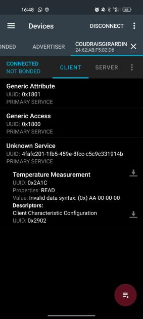

[Accueil](https://gitlab.com/cpelyon/rob/5irc-2023-2024/eic/sujet_1_tps_eic/S1_G3_Coudrais_Girardin/-/tree/main)  
[Partie 1](../Part1)  
[Partie 2](../Part2) 
[Partie 4](../Part4)

# Broker MQTT
- On lance et utilise notre broker mqtt de la même manière que dans la partie 1 
- - On se connecte au wifi de la salle 
- - On met bien le fichier de config mqtt au bon endroit dans nos fichiers temp 
- - On lance notre docker-compose et on regarde notre adresse ip qui sera aussi celle du broker mqtt

# ESP_temp
- On utilise le code d'exemple indiqué dans l'énoncé
- Il fallait simplement qu'on commente des lignes pour ne mettre que le droit de lecture dans notre service 
- On met un nom qui nous est propre a notre serveur bluetooth
- On change également le UUID du charactéristic que notre serveur BT envoie pour avoir une information indiquant qu'on envoie de la température : 
  
- Puis on récupère finalement la valeur du signal analogique du potentiomètre comme dans la partie 1 puis on l'envoie dans le signal bluetooth

# BLE_TO_MQTT Python
- On récupère le code python de l'énoncé du tp
- On regarde l'adresse mac de notre esp32 pour pouvoir la remplacer dans le code afin de s'y connecter en BLE
- On rajoute simplement un boule qui entoure la reception du message bluetooth pour ne pas s'arreter quand on recoit un message comme initialement.
- Puis on rajoute le système d'envoi mqtt qu'on a deja mis en place dans le code python de la partie 1. On garde le système d'envoie conditionnel et on passe dedans a chaque fois qu'on recoit une valeur en BLE.
- On peut toujours vérifier qu'on recoit bien les messages sur le topic avec la commande : `mosquitto_sub -h 192.168.1.39 -t /I102/CoudraisGirardin/air_flow -p 1884`

# Activation du volet
- On garde le même code que la partie 1 pour cette partie. On change simplement l'adresse ip sur serveur mqtt

# Résultat 
[Vidéo (part3_ble.mp4)](../images_videos/part3_ble.mp4)
