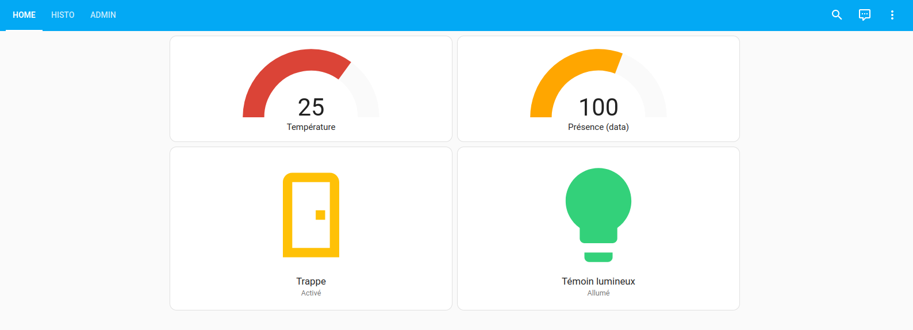

[Accueil](https://gitlab.com/cpelyon/rob/5irc-2023-2024/eic/sujet_1_tps_eic/S1_G3_Coudrais_Girardin/-/tree/main)  
[Partie 1](../Part1)  
[Partie 2](../Part2) 
[Partie 3](../Part3)

# Archi 
  
## Coté capteur
- 2 capteurs de présence 
- - Sharp 
- - Ultrasons 
- 1 capteur de température 
- - Potentiomètre 
- Lecture analogique 
- Utilisation des boutons pour selectionner capteur de présence 
- Affichage des infos capteurs a l'écran esp32 
- Envoie BLE avec 2 charactéristique (une pour data et l'autre pour temp) au PC => esp32 = serveur et PC = client (une temp et une data (présence))
- Reception sur un PC avec code python BLE to MQTT 
- Envoi MQTT sans traitement de données
- Broker MQTT fonctionne sur un réseau dans un conteneur docker

## Coté actionneur
- ESPHome et Assistant qui tournent sur un conteneur docker chacun
- Configuration Home Assistant (HA) => Rajout service MQTT 
- Transformation subcription topic MQTT en sensor HA.
- Configuration ESPHome
- - Mise a disposition servo moteur pour home assistant
- - - Switch permettant d'activier ou non sur une certaine position
- - - Range qui permet de le piloter avec plus de précision 
- - Mise a disposition led rgb pour home assistant 
- - - Controlleur de couleur, de on/off et d'intensité 
- Récupération dans HA
- - Rajout et configuration service ESPHome dans HA
- - Mise à disposition des controlleur sur tableau de bord HA avec les entité mise a disposition par ESPHome
- Rajout automatisation pour prise de décision ouverture / fermeture servo et led rouge / led verte
- Configuration d'un dashboard un peu plus poussé pour visualisation, monitoring prise de controle des equipements.

# Points techniques 
- Utilisation des librairies, docs, bons branchement pour le bon fonctionnement des nouveaux capteurs
- Utilisation de Arduino IDE coté sensor car envoi BLE et gestion des capteurs plus spécifique semblait plus simple pour nous que ESPHome
- Ajouter mosquitto.conf dans les fichier docker_volumes qu'on a mis dans le dicker compose 
- On a maintenant un broker monté sur notre adresse ip connecté au wifi de la salle 
- On se connecte a homeassistant a l'adresse suivante : `http://localhost:8123`
- On change la config home assistant en rentrant dans le bash du conteneur docker `sudo docker exec -it <container name> /bin/sh
` et on change le fichier `config/configuration.yaml` la ligne pour les automations est necessaire pour pouvoir créer des automatisations
- C'est finalement grace a ca qu'on créé une entité home assistant en s'abonnant a un topic mqtt
- Il nous a fallu au moins la premiere fois exectue notre yaml esphome en ligne de commande pour pouvoir bien y préciser l'usb : `sudo docker run --rm -v "tmp/docker_volumes/esphome/config":/config --device=/dev/ttyUSB0 -it ghcr.io/esphome/esphome run livingroom.yaml`
- Finalement, après avoir mieux compris le fonctionnement entre ESPHome et homeassistant. Faire des capteurs de template comme dans les TP d'avant ne nous sert a pas grand chose.
- - Il faut simplement configurer notre yaml ESPHome pour piloter notre servo moteur en y précisant les pin auquel il est branché et mettre a disposition des appareil et entité homeassistant pour piloter le servo a travers home assistant
- - Il faudra ensuite créer des automatisations a travers home assistant pour activer ou non le servo moteur => ouvrir ou non une trappe d'aération dans la maison.
- Pour brancher la led rgb, il faut mettre gnd sur la branche la plus longue puis bien faire correspondre notre code yaml et nos branchement pour les couleurs RGB avec les pin. On met egalement des resistances entre tous 
- Dans les automations, il faut bien éteindre puis rallumer la led en changeant la couleur en utilisant un service, le changement de couleur ne semblait pas fonctionner

# Vidéo projet 
[Vidéo (projet.mp4)](../images_videos/projet.mp4)

# Annexes 

## Ecran dashboard Home Assistant
  
  
  

## Automatisations Home Assistant
  
  

## Branchements
  
  
  

## Sources 
https://esphome.io/components/light/rgb.html  
https://esphome.io/components/servo.html  
https://www.youtube.com/watch?v=3GbyYQHQvV8  
